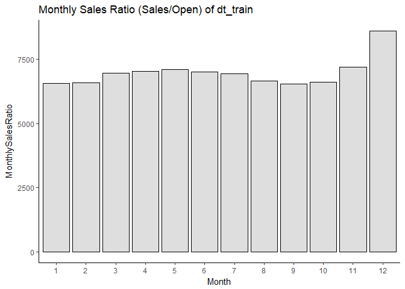
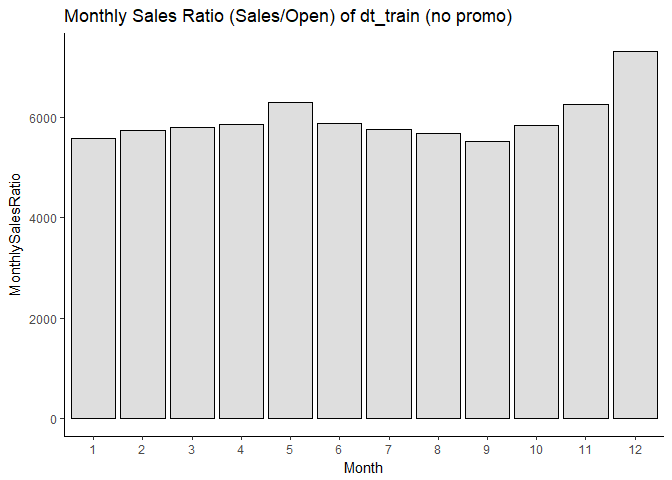
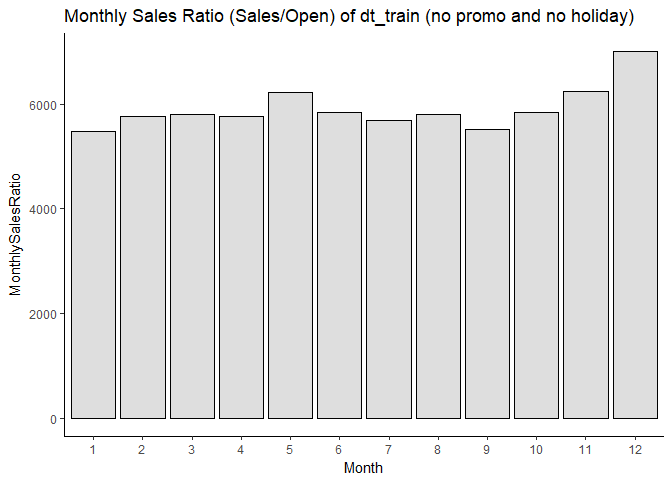

    ## Warning: package 'dtplyr' was built under R version 3.3.3

    ## Warning: package 'knitr' was built under R version 3.3.3

    ## Loading required package: zoo

    ## Warning: package 'zoo' was built under R version 3.3.3

    ## 
    ## Attaching package: 'zoo'

    ## The following objects are masked from 'package:base':
    ## 
    ##     as.Date, as.Date.numeric

    ## 
    ## Attaching package: 'xts'

    ## The following objects are masked from 'package:data.table':
    ## 
    ##     first, last

Introduction
------------

Please include introduction here.

Loading of data
---------------

Let's load up our data. We have two main CSV files given from the Kaggle website:

Taking a peek at the data
-------------------------

Let's first look at the data we have by looking at the first few rows.

### train.csv

|  Store|  DayOfWeek| Date       |  Sales|  Customers|  Open|  Promo| StateHoliday | SchoolHoliday |
|------:|----------:|:-----------|------:|----------:|-----:|------:|:-------------|:--------------|
|      1|          5| 2015-07-31 |   5263|        555|     1|      1| 0            | 1             |
|      2|          5| 2015-07-31 |   6064|        625|     1|      1| 0            | 1             |
|      3|          5| 2015-07-31 |   8314|        821|     1|      1| 0            | 1             |
|      4|          5| 2015-07-31 |  13995|       1498|     1|      1| 0            | 1             |
|      5|          5| 2015-07-31 |   4822|        559|     1|      1| 0            | 1             |
|      6|          5| 2015-07-31 |   5651|        589|     1|      1| 0            | 1             |

### store.csv

|  Store| StoreType | Assortment |  CompetitionDistance|  CompetitionOpenSinceMonth|  CompetitionOpenSinceYear|  Promo2|  Promo2SinceWeek|  Promo2SinceYear| PromoInterval   |
|------:|:----------|:-----------|--------------------:|--------------------------:|-------------------------:|-------:|----------------:|----------------:|:----------------|
|      1| c         | a          |                 1270|                          9|                      2008|       0|               NA|               NA|                 |
|      2| a         | a          |                  570|                         11|                      2007|       1|               13|             2010| Jan,Apr,Jul,Oct |
|      3| a         | a          |                14130|                         12|                      2006|       1|               14|             2011| Jan,Apr,Jul,Oct |
|      4| c         | c          |                  620|                          9|                      2009|       0|               NA|               NA|                 |
|      5| a         | a          |                29910|                          4|                      2015|       0|               NA|               NA|                 |
|      6| a         | a          |                  310|                         12|                      2013|       0|               NA|               NA|                 |

Cleaning of data
----------------

Let's clean up the data. First, let us review the data types of each column.

### train.csv

    ## Classes 'data.table' and 'data.frame':   1017209 obs. of  9 variables:
    ##  $ Store        : int  1 2 3 4 5 6 7 8 9 10 ...
    ##  $ DayOfWeek    : int  5 5 5 5 5 5 5 5 5 5 ...
    ##  $ Date         : chr  "2015-07-31" "2015-07-31" "2015-07-31" "2015-07-31" ...
    ##  $ Sales        : int  5263 6064 8314 13995 4822 5651 15344 8492 8565 7185 ...
    ##  $ Customers    : int  555 625 821 1498 559 589 1414 833 687 681 ...
    ##  $ Open         : int  1 1 1 1 1 1 1 1 1 1 ...
    ##  $ Promo        : int  1 1 1 1 1 1 1 1 1 1 ...
    ##  $ StateHoliday : chr  "0" "0" "0" "0" ...
    ##  $ SchoolHoliday: chr  "1" "1" "1" "1" ...
    ##  - attr(*, ".internal.selfref")=<externalptr>

### store.csv

    ## Classes 'data.table' and 'data.frame':   1115 obs. of  10 variables:
    ##  $ Store                    : int  1 2 3 4 5 6 7 8 9 10 ...
    ##  $ StoreType                : chr  "c" "a" "a" "c" ...
    ##  $ Assortment               : chr  "a" "a" "a" "c" ...
    ##  $ CompetitionDistance      : int  1270 570 14130 620 29910 310 24000 7520 2030 3160 ...
    ##  $ CompetitionOpenSinceMonth: int  9 11 12 9 4 12 4 10 8 9 ...
    ##  $ CompetitionOpenSinceYear : int  2008 2007 2006 2009 2015 2013 2013 2014 2000 2009 ...
    ##  $ Promo2                   : int  0 1 1 0 0 0 0 0 0 0 ...
    ##  $ Promo2SinceWeek          : int  NA 13 14 NA NA NA NA NA NA NA ...
    ##  $ Promo2SinceYear          : int  NA 2010 2011 NA NA NA NA NA NA NA ...
    ##  $ PromoInterval            : chr  "" "Jan,Apr,Jul,Oct" "Jan,Apr,Jul,Oct" "" ...
    ##  - attr(*, ".internal.selfref")=<externalptr>

Looks like we are dealing with a mix of int and chr data types. Here are some quick takeaways:

-   dt\_train
    -   Date is currently a chr data type. We will change it to DATE type.
    -   StateHoliday is categorical (4 categories)
    -   SchoolHoliday is binary
    -   When Open == 0, then Sales == 0 (as expected)
    -   No NA's are found
-   dt\_store
    -   StoreType is categorical (4 categories)
    -   Assortment is categorical (3 categories)
    -   Promo2 is binary
    -   PromoInterval describes the consecutive intervals Promo2 is started.

Understanding our data
----------------------

We will be looking at our data this time per column. First of all, let us note how much data we are dealing with.

Total number of rows for train.csv:

    ## [1] 1017209

Total number of rows for store.csv:

    ## [1] 1115

Let us check dt\_store to make sure that each store ID has one row.

``` r
length(unique(dt_store[,Store])) == dt_store[,.N]
```

    ## [1] TRUE

As it is TRUE, then the unique number of Store ID's match the number of rows. Therefore, there is no duplicate Store ID.

#### Store

This seems to be the store ID that we can use to match dt\_store with dt\_train. We can use this to join the two data sets.

#### DayOfWeek

The number represents the day of the week

#### Date

Calendar date of the reported sales

    ## 15706 to 16647

#### Sales

The sales recorded (if store is Open). Here is a summary of the Sales column:

    ##    Min. 1st Qu.  Median    Mean 3rd Qu.    Max. 
    ##       0    3727    5744    5774    7856   41550

#### Customers

The number of customers of that Date. Here is a summary of the Customers column:

    ##    Min. 1st Qu.  Median    Mean 3rd Qu.    Max. 
    ##     0.0   405.0   609.0   633.1   837.0  7388.0

Let's see if there are any stores that were Open and had 0 Customers

    ## 52 stores were open that had 0 customers

Ah! There are 52 instances. Let's break it down later.

#### Open

0 -&gt; closed; 1 -&gt; open. If 0, then Sales = 0.

Let's rank the stores by the number of days they were Open

    ##     Store DaysOpen
    ##  1:    85      942
    ##  2:   262      942
    ##  3:   335      942
    ##  4:   423      942
    ##  5:   494      942
    ##  6:   562      942
    ##  7:   682      942
    ##  8:   733      942
    ##  9:   769      942
    ## 10:  1097      942

    ##     Store DaysOpen
    ##  1:    22      619
    ##  2:   638      618
    ##  3:   492      614
    ##  4:   183      611
    ##  5:   145      608
    ##  6:   909      607
    ##  7:   100      606
    ##  8:   744      605
    ##  9:   348      597
    ## 10:   644      592

Were all of the stores open since day 1 of our data set?

    ## 1.53% stores open at 2013-01-01

Well that isn't much. Probably because of New Year.

    ## 99.64% stores open at 2013-01-02

That looks better.

Let's plot the % of stores open across the time period without including StateHoliday, SchoolHoliday, and Sundays (for all stores):

    ## Warning: Removed 106 rows containing missing values (geom_point).


#### Promo

Indicates whether a store is running a promo on that day.

Did the company run store-specific sales (i.e. only certain stores ran the promo)? Let's try to find out. Let's take the percentage of the total number of Rows with Promo == 1 by the total number of Rows, and do it per Date. Let's look at the number of rows that is between 0 and 100%.

    ## [1] 0

Ah there is none. How about looking at the values? First, let's see how many Dates have Promos being run, but not as many as the total number of stores (1115)

    ## [1] 74

Oh. There are 74 Dates. Let's take a look at one and see what's happening. First, let's make two temporary data.tables and set their keys to Date. Then let us query dt\_train with Dates of those 74 instances.

This is the summary of the dataset of those 74 instances:

    ##      Store          DayOfWeek          Date                Sales      
    ##  Min.   :   1.0   Min.   :1.000   Min.   :2014-07-01   Min.   :    0  
    ##  1st Qu.: 286.0   1st Qu.:2.000   1st Qu.:2014-08-08   1st Qu.: 6120  
    ##  Median : 559.0   Median :3.000   Median :2014-10-01   Median : 7772  
    ##  Mean   : 560.5   Mean   :3.027   Mean   :2014-09-27   Mean   : 8276  
    ##  3rd Qu.: 841.0   3rd Qu.:4.000   3rd Qu.:2014-11-11   3rd Qu.: 9840  
    ##  Max.   :1115.0   Max.   :5.000   Max.   :2014-12-19   Max.   :35702  
    ##    Customers           Open           Promo   StateHoliday      
    ##  Min.   :   0.0   Min.   :0.000   Min.   :1   Length:69190      
    ##  1st Qu.: 609.0   1st Qu.:1.000   1st Qu.:1   Class :character  
    ##  Median : 775.0   Median :1.000   Median :1   Mode  :character  
    ##  Mean   : 856.8   Mean   :0.985   Mean   :1                     
    ##  3rd Qu.:1000.0   3rd Qu.:1.000   3rd Qu.:1                     
    ##  Max.   :5494.0   Max.   :1.000   Max.   :1                     
    ##  SchoolHoliday           Year          Month             Week      
    ##  Length:69190       Min.   :2014   Min.   : 7.000   Min.   :27.00  
    ##  Class :character   1st Qu.:2014   1st Qu.: 8.000   1st Qu.:32.00  
    ##  Mode  :character   Median :2014   Median :10.000   Median :40.00  
    ##                     Mean   :2014   Mean   : 9.486   Mean   :39.31  
    ##                     3rd Qu.:2014   3rd Qu.:11.000   3rd Qu.:46.00  
    ##                     Max.   :2014   Max.   :12.000   Max.   :51.00  
    ##     AllPromo  
    ##  Min.   :935  
    ##  1st Qu.:935  
    ##  Median :935  
    ##  Mean   :935  
    ##  3rd Qu.:935  
    ##  Max.   :935

We see that it only happened between 2014-07-01 to 2014-12-19. We also note that are stores that are closed, but it has been recorded that there is a Promo. Let's take a look.

This is the summary of the dataset of stores that were Open, and not following a holiday:

    ##      Store          DayOfWeek          Date                Sales  
    ##  Min.   :  57.0   Min.   :1.000   Min.   :2014-07-01   Min.   :0  
    ##  1st Qu.: 532.5   1st Qu.:2.000   1st Qu.:2014-07-15   1st Qu.:0  
    ##  Median : 708.0   Median :3.000   Median :2014-09-02   Median :0  
    ##  Mean   : 676.4   Mean   :3.159   Mean   :2014-08-15   Mean   :0  
    ##  3rd Qu.: 887.0   3rd Qu.:4.000   3rd Qu.:2014-09-15   3rd Qu.:0  
    ##  Max.   :1021.0   Max.   :5.000   Max.   :2014-10-08   Max.   :0  
    ##    Customers      Open       Promo   StateHoliday       SchoolHoliday     
    ##  Min.   :0   Min.   :0   Min.   :1   Length:63          Length:63         
    ##  1st Qu.:0   1st Qu.:0   1st Qu.:1   Class :character   Class :character  
    ##  Median :0   Median :0   Median :1   Mode  :character   Mode  :character  
    ##  Mean   :0   Mean   :0   Mean   :1                                        
    ##  3rd Qu.:0   3rd Qu.:0   3rd Qu.:1                                        
    ##  Max.   :0   Max.   :0   Max.   :1                                        
    ##       Year          Month             Week          AllPromo  
    ##  Min.   :2014   Min.   : 7.000   Min.   :27.00   Min.   :935  
    ##  1st Qu.:2014   1st Qu.: 7.000   1st Qu.:29.00   1st Qu.:935  
    ##  Median :2014   Median : 9.000   Median :36.00   Median :935  
    ##  Mean   :2014   Mean   : 8.175   Mean   :33.21   Mean   :935  
    ##  3rd Qu.:2014   3rd Qu.: 9.000   3rd Qu.:37.50   3rd Qu.:935  
    ##  Max.   :2014   Max.   :10.000   Max.   :41.00   Max.   :935

We have to keep this in mind that having a Promo does not mean the store was Open, even when there were no holidays.

#### StateHoliday

a -&gt; public holiday b -&gt; Easter holiday c -&gt; Christmas 0 -&gt; None

Let's check the integrity of the StateHoliday. We want to make sure that at a given StateHoliday, all of the stores have the StateHoliday field correctly identified. For example, during Christmas (StateHoliday = c), are there any stores that do have StateHoliday != c?

    ## These are the unique holidays during a Public Holiday: a 0

    ## These are the unique holidays during Easter Holiday: b

    ## These are the unique holidays during Christmas: c

Let us investigate Public Holiday. Can we find the dates where StateHoliday is not only a?

    ## These are the dates that had both StateHoliday == a and 0

    ##  [1] "2013-01-06" "2013-05-30" "2013-08-15" "2013-10-31" "2013-11-01"
    ##  [6] "2013-11-20" "2014-01-06" "2014-06-19" "2014-10-31" "2014-11-01"
    ## [11] "2014-11-19" "2015-01-01" "2015-01-06" "2015-06-04"

Let's look at one of these dates and see the percentage of stores that were still open:

    ## These are the stats for the date: 2015-06-04

    ## 432 stores were open

    ## 1115 total stores recorded in that date

    ## 38.74% stores were open

Later on, let's try to find out what may have cause these stores to be open still. Could public holiday just be limited to certain areas?

Sales
-----

This is the main part of the analysis, and what we want to predict in the future.

#### Histogram

Let's start with the histogram of Sales (not including Closed)  

Ratio of Monthly Sales to Stores Open

    ##     Month MonthlySalesRatio
    ##  1:     1          6563.690
    ##  2:     2          6589.166
    ##  3:     3          6976.412
    ##  4:     4          7046.228
    ##  5:     5          7106.453
    ##  6:     6          7000.978
    ##  7:     7          6952.682
    ##  8:     8          6648.985
    ##  9:     9          6546.343
    ## 10:    10          6602.843
    ## 11:    11          7188.554
    ## 12:    12          8608.957



December has a high Sales/Open ratio. Let's redo the plot after removing promos:

Ratio of Monthly Sales to Stores Open (no promos, Promo2 still included)

    ##     Month MonthlySalesRatio
    ##  1:     1          5591.904
    ##  2:     2          5747.813
    ##  3:     3          5805.724
    ##  4:     4          5855.305
    ##  5:     5          6300.750
    ##  6:     6          5871.747
    ##  7:     7          5751.912
    ##  8:     8          5680.221
    ##  9:     9          5528.634
    ## 10:    10          5845.746
    ## 11:    11          6257.749
    ## 12:    12          7318.434



The ratios drop, but December still has the highest ratio. Let us remove both Promo and Holidays:

Ratio of Monthly Sales to Stores Open (no promos and holidays, Promo2 still included)

    ##     Month MonthlySalesRatio
    ##  1:     1          5487.487
    ##  2:     2          5772.596
    ##  3:     3          5803.841
    ##  4:     4          5772.121
    ##  5:     5          6230.209
    ##  6:     6          5847.752
    ##  7:     7          5688.635
    ##  8:     8          5805.399
    ##  9:     9          5525.473
    ## 10:    10          5841.588
    ## 11:    11          6247.460
    ## 12:    12          7006.962



Combining the three plots:

    ##     Month MonthlySalesRatio MonthlySalesRatio_NoPromo
    ##  1:     1          6563.690                  5591.904
    ##  2:     2          6589.166                  5747.813
    ##  3:     3          6976.412                  5805.724
    ##  4:     4          7046.228                  5855.305
    ##  5:     5          7106.453                  6300.750
    ##  6:     6          7000.978                  5871.747
    ##  7:     7          6952.682                  5751.912
    ##  8:     8          6648.985                  5680.221
    ##  9:     9          6546.343                  5528.634
    ## 10:    10          6602.843                  5845.746
    ## 11:    11          7188.554                  6257.749
    ## 12:    12          8608.957                  7318.434
    ##     MonthlySalesRatio_NoPromo_NoHoliday
    ##  1:                            5487.487
    ##  2:                            5772.596
    ##  3:                            5803.841
    ##  4:                            5772.121
    ##  5:                            6230.209
    ##  6:                            5847.752
    ##  7:                            5688.635
    ##  8:                            5805.399
    ##  9:                            5525.473
    ## 10:                            5841.588
    ## 11:                            6247.460
    ## 12:                            7006.962


Sales broken down into Promo:

    ##     Month MonthlySales_NoPromo MonthlySales_Promo
    ##  1:     1            268663039          298065685
    ##  2:     2            269601161          259133249
    ##  3:     3            260386701          339445205
    ##  4:     4            256860539          319034756
    ##  5:     5            277176280          292071937
    ##  6:     6            277228671          300884104
    ##  7:     7            256374200          338685005
    ##  8:     8            175780115          186011087
    ##  9:     9            166002767          176567364
    ## 10:    10            180545850          171332878
    ## 11:    11            164585061          204913816
    ## 12:    12            218769953          215061200

    ##     Month MonthlySalesPercentage_NoPromo MonthlySalesPercentage_Promo
    ##  1:     1                          47.41                        52.59
    ##  2:     2                          50.99                        49.01
    ##  3:     3                          43.41                        56.59
    ##  4:     4                          44.60                        55.40
    ##  5:     5                          48.69                        51.31
    ##  6:     6                          47.95                        52.05
    ##  7:     7                          43.08                        56.92
    ##  8:     8                          48.59                        51.41
    ##  9:     9                          48.46                        51.54
    ## 10:    10                          51.31                        48.69
    ## 11:    11                          44.54                        55.46
    ## 12:    12                          50.43                        49.57


Normalized Sales vs Number of Open Stores/Month for Promo and Without Promo:

    ##     Month MonthlySalesNormalized_NoPromo MonthlySalesNormalized_Promo
    ##  1:     1                       5591.904                     7782.800
    ##  2:     2                       5747.813                     7772.909
    ##  3:     3                       5805.724                     8252.983
    ##  4:     4                       5855.305                     8426.030
    ##  5:     5                       6300.750                     8087.947
    ##  6:     6                       5871.747                     8508.685
    ##  7:     7                       5751.912                     8257.589
    ##  8:     8                       5680.221                     7926.496
    ##  9:     9                       5528.634                     7916.399
    ## 10:    10                       5845.746                     7646.400
    ## 11:    11                       6257.749                     8163.897
    ## 12:    12                       7318.434                    10490.790
    ##     MonthlySalesNormalized_Total
    ##  1:                     6563.690
    ##  2:                     6589.166
    ##  3:                     6976.412
    ##  4:                     7046.228
    ##  5:                     7106.453
    ##  6:                     7000.978
    ##  7:                     6952.682
    ##  8:                     6648.985
    ##  9:                     6546.343
    ## 10:                     6602.843
    ## 11:                     7188.554
    ## 12:                     8608.957


Sales vs Number of Stores Open


Yearly Sales

    ## Warning in gsum(Sales): Group 1 summed to more than type 'integer' can hold
    ## so the result has been coerced to 'numeric' automatically, for convenience.


Ratio of Yearly Sales to Stores Open

    ##    Year YearlySalesRatio
    ## 1: 2013         6814.392
    ## 2: 2014         7025.404
    ## 3: 2015         7088.127


Competitor
----------

I want to look at competitor information, and see if it has any obvious relationships first.

Distance of Competitor:

    ## Warning: Removed 613 rows containing non-finite values (stat_bin).


Average competitor distance based on year opening

    ## Warning: Removed 408 rows containing non-finite values (stat_boxplot).


Do competitor(s) has/have a preference for opening month?

    ## Warning: Ignoring unknown parameters: binwidth, bins, pad


How about what year they opened?

    ## Warning: Ignoring unknown parameters: binwidth, bins, pad


How does competition affect sales?

Sales data starts from 2013-01-01 to 2015-07-31. Let's find a store with a competitor that opened between those times.

    ## There are 191 stores with nearest competitors that opened 2013 onwards

The data does not state the next nearest competitor, nor when that competitor opened. Therefore, we will look at the distribution of sales impact by nearest competitor opening to take into account unmeasureable variations (we cannot measure the effects of number of competitors within a certain meter radius for example).

This analysis is a little tricky because of time. For example, is there growth that we need to take into account? Let's sidetrack a bit to see a store's performance over time. Here are stores that I will be doing an initial view of:

Assortment -- Store \# a -- 30 b -- none c -- 103

    ## `geom_smooth()` using method = 'loess'


    ## `geom_smooth()` using method = 'loess'


    ## `geom_smooth()` using method = 'loess'


Let's add in competition
